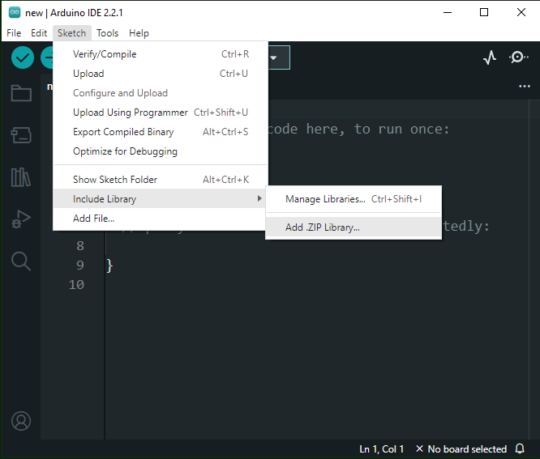
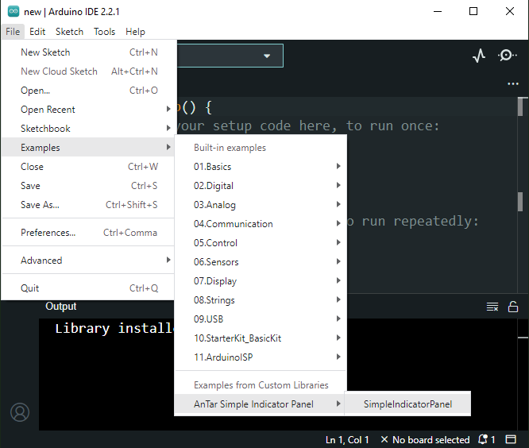
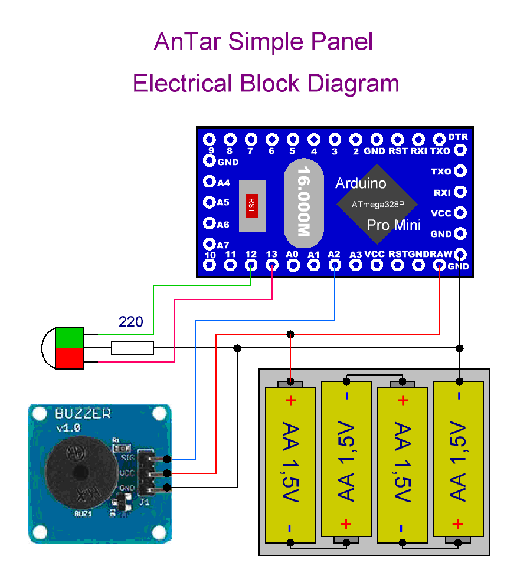
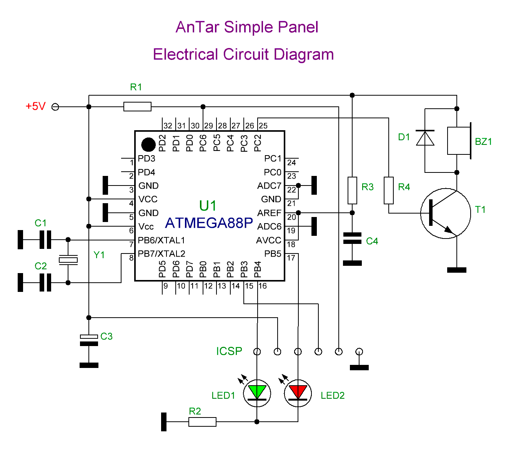

# A Simple Indicator Panel Library for Arduino

## Purpose

This library allows you to control simple indicator panel with LEDs and buzzer. 

For more information about this library please visit us at
[https://github.com/TarAndr/AnTar_SIP](https://github.com/TarAndr/AnTar_SIP "https://github.com/TarAndr/AnTar_SIP")

------------


## Content:
- [Purpose](#purpose "Purpose")
- [License agreement](#mit-license "License agreement")
- [Installation](#installation "Installation")
- [Description](#description "Description")
	- [Technical requirements](#technical-requirements "Technical requirements")
	- [Library methods](#library-methods "Library methods")
	- [Simple example](#simple-example "Simple example")
- [Conclusion](#conclusion "Conclusion")


------------


## MIT License

Copyright (c) 2023 Andrey Tarasenko

Permission is hereby granted, free of charge, to any person obtaining a copy
of this software and associated documentation files (the "Software"), to deal
in the Software without restriction, including without limitation the rights
to use, copy, modify, merge, publish, distribute, sublicense, and/or sell
copies of the Software, and to permit persons to whom the Software is
furnished to do so, subject to the following conditions:

The above copyright notice and this permission notice shall be included in all
copies or substantial portions of the Software.

THE SOFTWARE IS PROVIDED "AS IS", WITHOUT WARRANTY OF ANY KIND, EXPRESS OR
IMPLIED, INCLUDING BUT NOT LIMITED TO THE WARRANTIES OF MERCHANTABILITY,
FITNESS FOR A PARTICULAR PURPOSE AND NONINFRINGEMENT. IN NO EVENT SHALL THE
AUTHORS OR COPYRIGHT HOLDERS BE LIABLE FOR ANY CLAIM, DAMAGES OR OTHER
LIABILITY, WHETHER IN AN ACTION OF CONTRACT, TORT OR OTHERWISE, ARISING FROM,
OUT OF OR IN CONNECTION WITH THE SOFTWARE OR THE USE OR OTHER DEALINGS IN THE
SOFTWARE.

------------


## Video
extras\video\AnTar SIP.mp4

------------


## Installation
To use the functions of the library, you first need to download and install it, and then connect it to the source code of your program.

You can download the library from the version control system repository. It is recommended to always download the stable version from the repository page in the section https://github.com/TarAndr/AnTar_SIP/releases. But if you wish or have difficulties, you can use the latest published version on the main branch of the repository at https://github.com/TarAndr/AnTar_SIP/archive/main.zip.

After downloading, the archive must be unpacked into the Arduino libraries folder, for example for the Windows operating system this can be the “*Documents\Arduino\libraries*” folder. The downloaded archive can also be integrated through the development environment itself, which will probably be a more correct solution. To do this, in the "**Sketch**" section from the "**Include Library**" list, select "**Add ZIP Library...**" and specify the library archive file:

[](extras/images/Add_ZIP_Library.png "Sketch >> Include Library >> Add ZIP Library...")

If the above steps are completed successfully, the message “**Library installed**” should appear in the information window, and examples of installed libraries should appear in the examples of installed libraries for working with the newly added library:

[](extras/images/Examples.png "Examples for working with the library")

Having opened the selected example, you can start your own project based on it or copy parts of the example code into an existing project that you started earlier. Next we will look at what steps need to be taken to do this.


------------


## Description
The purpose of the library is to indicate various, predetermined states or events of the device using various light and sound signals. First, let's look at the hardware component necessary to provide the required functionality.


### Technical requirements
The output components are LEDs and a miniature buzzer, although light bulbs and/or a loudspeaker with associated controls can of course be used if desired. Alert signals are not very complex and are impulses of a certain duration with a given number of repetitions.

These pulses control the lighting of the LEDs and the sound of the buzzer. At the time of writing the first version, a two-color LED with red and green components was used, although separate LEDs can be used, and in the future, if necessary, the library can be modified to work with a three-color RGB LED to determine a wide range of different glow colors.

LEDs and a buzzer are connected to any pins of the Arduino board, which are specified in the sketch programmatically:

[](extras/images/AnTar_SIP_Electrical_Block_Diagram.GIF "Block diagram of connections of executive nodes to the Arduino board")

You can also use a microcontroller without a debugging board as a control device, having first compiled and downloaded the source code for it:

[](extras/images/AnTar_SIP_Electrical_Circuit_Diagram.GIF "Schematic diagram of the indicator panel on the microcontroller")

In this particular case, in both circuits, a two-color LED is connected through one common current-limiting resistor and works normally, since the supply voltage is 5 Volts; with a lower supply voltage, it is recommended to use separate current-limiting resistors for each crystal, since with a mixed glow one color will overlap another due to differences in voltage drops on LEDs of different glow colors.


### Library methods

First of all, the library file must be included using the #include directive as shown below:

`#include <AnTar_SIP.h>`

Next, an object is created as an instance of the library class, and here the parameters for setting the connected panel pins are passed to the constructor:

`SIP myPanel(redLedPin, greenLedPin, buzzerPin, buzzerFreq);`

Here the object name can be anything valid, and not necessarily "myPanel". The pin numbers for the red LED, green LED and buzzer are transmitted as parameters, respectively. The last parameter passes the resonant frequency of the buzzer used, and if it is not set explicitly without passing this parameter to the constructor, then the frequency will be set to the default value, which can be viewed and overridden in the source code of the "AnTar_SIP.h" library.

The frequency of the buzzer can also be changed while the program is running, and in the specified source code file you can view in detail the available methods and constants for working with the library. For example, to change the sound frequency, the following method is defined:

`myPanel.setBuzzerFreq(buzzerFreq);`

Where the newly set frequency in Hertz is transmitted as the **buzzerFreq** parameter. **setBuzzerFreq();** method; called without parameters also sets the buzzer sound frequency to the default value.

The main method for displaying information on the panel in the form of light and sound signals is the **signal(mode);** method; where the number of a predefined display mode is passed as a parameter, for example like this:

`myPanel.signal(4);`

This can be a short double beep with the simultaneous lighting of the green LED, or three repeated long beeps along with the glow of the red LED. But since remembering mode numbers by heart is inconvenient and not aesthetically pleasing, since magic numbers appear in the program code, a list of mode numbers with clear names was defined in the library file (but not in the class itself).

But since the library was created from the idea of electronic lock indication signals, the names of the modes here are appropriate. At the time of writing, the list of modes looked like this:

```cpp
enum signalMode {
     shortBeep = 0,
     lowPowerAlarm,
     emptyPowerAlarm,
     lockAlarm,
     lockOpened
     lockClosed
     toLockAlarm,
     modesNum // this is to determine the number of modes
};
```


As can be seen from the listing of a total of seven indication signal modes here, the last value is used to determine the number of modes, which can always be increased at your discretion. To do this, you need to work a little on the structure of the mode parameters, where the duration and number of signal repetitions are set, as well as which LEDs are used in a particular mode.

Using this enumeration, you can, for example, enable the indication of a completely discharged battery without thinking about the number of the required signal, by calling the corresponding method as follows:

`myPanel.signal(emptyPowerAlarm);`

In addition to the main method, the library defines an auxiliary method designed to disable and/or enable the buzzer sound:

`mute(state);`

If you call the **mute();** without parameters or with the value **true**, the buzzer will not be activated during the indication. For example usage:

```cpp
myPanel.mute();
// or
myPanel.mute(true);
```


To subsequently activate the buzzer, you will need to call the specified method with the value **false**, as in this example:

`myPanel.mute(false);`


### Simple example

And finally, a complete basic example is given for sequentially displaying all available modes with a slight delay between transitions and repetition. In the body of the main loop, all available preset states are cycled through, reproducing the corresponding light and sound signals:

```cpp
// Connecting the library
#include <AnTar_SIP.h>

// Pin numbers:
const int redLedPin = 13;
const int greenLedPin = 12;
const int buzzerPin = A2;
const long buzzerFreq = 4400;

// create an instance of the panel class, specifying
// the pins it's attached to and/or buzzer frequency
SIP myPanel(redLedPin, greenLedPin, buzzerPin, buzzerFreq);

// without frequency setting (with default value):
//SIP myPanel(redLedPin, greenLedPin, buzzerPin);

void setup() {
  // setting the buzzer frequency to 4400 Hz
  //myPanel.setBuzzerFreq(buzzerFreq);

  // Setting the default buzzer frequency
  //myPanel.setBuzzerFreq();
}

void loop() {
  // switching modes
	for(int mode = shortBeep; mode < modesNum; ++mode) {
		myPanel.signal(mode);
		delay(1000);
	}
	delay(2000);
}
```


------------


## Conclusion


Thank you for exploring the AnTar Simple Indicator Panel (SIP) library for Arduino. We hope this library provides you with a straightforward solution for integrating LED and buzzer-based indicator panels into your projects. Your feedback and contributions are highly appreciated. Feel free to report any issues, suggest improvements, or contribute to the development of this library on GitHub.

Happy coding with AnTar SIP!

Documentation made in [Open source online Markdown editor](https://pandao.github.io/editor.md/en.html "Open source online Markdown editor") 
and converted to HTML in [StackEdit](https://stackedit.io/app# "StackEdit").